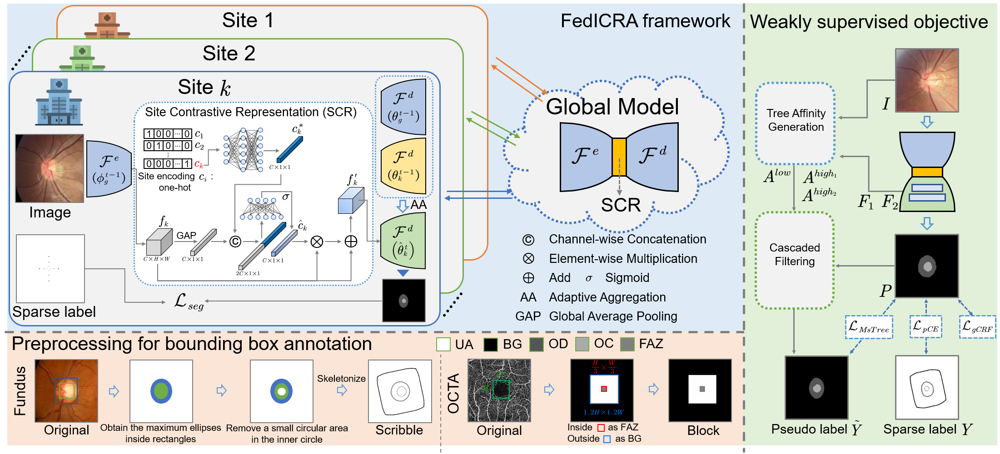
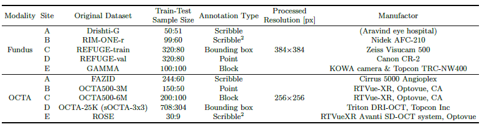
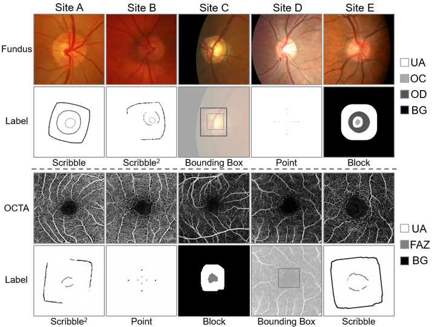
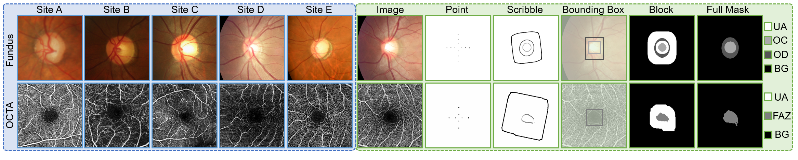

# Unifying and Personalizing Weakly-supervised Federated Medical Image Segmentation via Adaptive Representation and Aggregation
This project was developed for our submitted paper: [**Unifying and Personalizing Weakly-supervised Federated Medical Image Segmentation via Adaptive Representation and Aggregation**]([https://github.com/miccai2418/FedICRA](https://arxiv.org/abs/2304.05635))

**Abstract.** Federated learning (FL) enables multiple sites to collaboratively train powerful deep models without compromising data privacy and security. The statistical heterogeneity (e.g., non-IID data and domain shifts) is a primary obstacle in FL, impairing the generalization performance of the global model.Weakly supervised segmentation, which uses sparsely-grained (i.e., point-, bounding box-, scribble-, block-wise) supervision, is increasingly being paid attention to due to its great potential of reducing annotation costs. However, there may exist label heterogeneity, i.e., different annotation forms across sites. In this paper, we propose a novel personalized FL framework for medical image segmentation, named FedICRA, which uniformly leverages heterogeneous weak supervision via adaptIve Contrastive Representation and Aggregation. Concretely, to facilitate personalized modeling and to avoid confusion, a channel selection based site contrastive representation module is employed to adaptively cluster intra-site embeddings and separate inter-site ones. To effectively integrate the common knowledge from the global model with the unique knowledge from each local model, an adaptive aggregation module is applied for updating and initializing local models at the element level. Additionally, a weakly supervised objective function that leverages a multiscale tree energy loss and a gated CRF loss is employed to generate more precise pseudo-labels and further boost the segmentation performance. Through extensive experiments on two distinct medical image segmentation tasks of different modalities, the proposed FedICRA demonstrates overwhelming performance over other state-ofthe-art personalized FL methods. Its performance even approaches that of fully supervised training on centralized data.
# Datasets
## Details of the datasets

## Training set
Examples of the image and the corresponding sparse annotation from each site.

# Data Heterogeneity

**Left:** Data samples from different sites showcase the domain shifts in their distributions; \
**Right:** Examples of various types of sparse annotations and the corresponding full masks. UA, OC, OD, FAZ, and BG respectively represent unlabeled area, optic cup, optic disc, foveal avascular zone, and background.
# Visualization Results

# Requirements
Some important required packages are lised below:
* Pytorch 1.10.2
* efficientnet-pytorch 0.7.1
* tensorboardx 2.5.1
* medpy 0.4.0
* scikit-image 0.19.3
* simpleitk  2.1.1.2
* flwr 1.0.0
* Python >= 3.9
# Usage
## 1. Clone this project
``` bash
git clone https://github.com/miccai2418/FedICRA
cd FedICRA
```

## 2. Create a conda environment
``` bash
conda env create -n fed39v2 -f fed39v2.yaml
conda activate fed39v2
pip install tree_filter-0.1-cp39-cp39-linux_x86_64.whl
```
## 3. Pre-processing
Data preprocessing includes normalizing all image intensities to between 0 and 1, while data augmentation includes randomly flipping images horizontally and vertically as well as rotation (spanning from -45° to 45°).

## 4. Train the model
``` bash 
python flower_runner.py --port 8097 --procedure flower_pCE_2D_GateCRFMsacleTreeEnergyLoss_Ours --exp faz/WeaklySeg_pCE --base_lr 0.01 --img_class faz --model unet_lc_multihead --gpus 0 1 2 3 4 5 --strategy FedICRA --alpha 1 --rep_iters 3
```

## 5. Test the model
``` bash
python -u test_client4onemod_FL_Personalize.py --client client0 --num_classes 2 --in_chns 1 --root_path ../test/ --img_class faz --exp faz/FedICRA_Model/ --min_num_clients 5 --cid 0 --model unet_lc_multihead
```

# Acknowledgement
* [WSL4MIS](https://github.com/HiLab-git/WSL4MIS)
* [flower](https://github.com/mher/flower)
