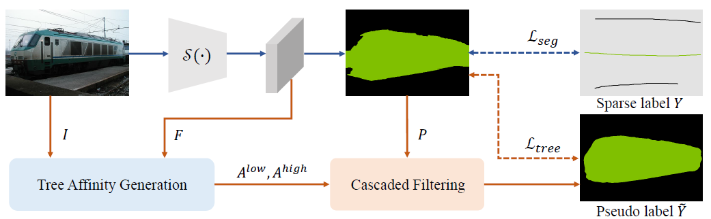

# Tree Energy Loss: Towards Sparsely Annotated Semantic Segmentation


## Introduction
This repository is an official implementation of the CVPR 2022 paper [Tree Energy Loss: Towards Sparsely Annotated Semantic Segmentation](https://arxiv.org/abs/2203.10739).



**Abstract.** Sparsely annotated semantic segmentation (SASS) aims to train a segmentation network with coarse-grained (i.e.,
point-, scribble-, and block-wise) supervisions, where only  a small proportion of pixels are labeled in each image. In
this paper, we propose a novel tree energy loss for SASS by providing semantic guidance for unlabeled pixels. The
tree energy loss represents images as minimum spanning trees to model both low-level and high-level pair-wise affinities.
By sequentially applying these affinities to the network prediction, soft pseudo labels for unlabeled pixels are
generated in a coarse-to-fine manner, achieving dynamic online self-training. The tree energy loss is effective and
easy to be incorporated into existing frameworks by combining it with a traditional segmentation loss.

## News
(03/03/2022) Tree Energy Loss has been accepted by CVPR 2022.

(15/03/2022) Update codes and models. 

## Main Results
|  **Method**  | **Backbone** | **Dataset**  |  **Annotation**  |  **mIoU**  |  **Model**  |
|:------:|:------:|:------:|:------:|:------:| :------:| 
| HRNet      | [HRNet_w48](https://drive.google.com/file/d/1VSO6H8rERkz35NN1YwGCUKMfDlQBiek2/view?usp=sharing) | Cityscapes | block50  | 72.2 | [google](https://drive.google.com/file/d/1c0CezvGPXSiAKF7WAQlH1xzNT7rBqFWc/view?usp=sharing) |
| HRNet      | HRNet_w48 | Cityscapes | block20  | 66.8 | [google](https://drive.google.com/file/d/16gcEUD7-3ou42_YOXMu301UKL4cmqQu6/view?usp=sharing) |
| HRNet      | HRNet_w48 | Cityscapes | block10  | 61.8 | [google](https://drive.google.com/file/d/1CxRXUQTaIYKPvVAUEhxOIrcrsbLDKei3/view?usp=sharing) |
| HRNet      | HRNet_w48 | ADE20k     | block50  | 40.3 | [google](https://drive.google.com/file/d/1FqQam5mgZChLe20k0wDttAdvpwKVSy4j/view?usp=sharing) |
| HRNet      | HRNet_w48 | ADE20k     | block20  | 36.5 | [google](https://drive.google.com/file/d/1BvRFyZNM-DAsgl9F6B97qgsxdquiHjwg/view?usp=sharing) |
| HRNet      | HRNet_w48 | ADE20k     | block10  | 34.7 | [google](https://drive.google.com/file/d/15LnWve8Yo8k5qgm3c6l92x5JFaiO5TG9/view?usp=sharing) |
| DeeplabV3+ | [ResNet101](https://drive.google.com/file/d/1ciN4ETiqEOchgG6SBs8O1i2mOeNcahbJ/view?usp=sharing) | VOC2012    | point    | 65.4 | [google](https://drive.google.com/file/d/14oZolbviusChSkcmJLFY5YGRYxJR40Qa/view?usp=sharing) |
| LTF        | ResNet101 | VOC2012    | point    | 68.0 | [google](https://drive.google.com/file/d/1uDswB7dpeTD3J7Tb9pQGVwljV5muPLZN/view?usp=sharing) |
| DeeplabV3+ | ResNet101 | VOC2012    | scribble | 77.6 | [google](https://drive.google.com/file/d/1SfUAqTihunJ9RrDHRYNpdouzfFQ4BOoq/view?usp=sharing) |
| LTF        | ResNet101 | VOC2012    | scribble | 77.4 | [google](https://drive.google.com/file/d/1-iqsQKZX-ZHrKGdJrWJzChzsNWGwZqNx/view?usp=sharing) |

## Requirements
* Linux, Python>=3.6, CUDA>=10.0, pytorch == 1.7.1

## Installation
This implementation is built upon [openseg.pytorch](https://github.com/openseg-group/openseg.pytorch/tree/pytorch-1.7) and [TreeFilter-Torch](https://github.com/Megvii-BaseDetection/TreeFilter-Torch).
Many thanks to the authors for the efforts.

* git clone https://github.com/megvii-research/TreeEnergyLoss
* cd TreeEnergyLoss
* pip install -r requirements.txt
* cd kernels/lib_tree_filter
* sudo python3 setup.py build develop

### Sparse Annotation Preparation
* Please first follow the [Getting Started](https://github.com/openseg-group/openseg.pytorch/blob/master/GETTING_STARTED.md) for data preparation.
* Download [scribble and point annotations](https://github.com/LEONOB2014/GatedCRFLoss/tree/master/datasets) provided by GatedCRFLoss.
* Download [block annotations](https://drive.google.com/drive/folders/1PimNy1On--zFrAcuIkL7sLkMFHu9FkIa?usp=sharing) provided by ours.

and finally, the dataset directory should look like:
```
$DATA_ROOT
├── cityscapes
│   ├── train
│   │   ├── image
│   │   ├── label
│   │   └── sparse_label
│   │       ├── block10
│   │       ├── block20
│   │       └── block50
│   ├── val
│   │   ├── image
│   │   └── label
├── ade20k
│   ├── train
│   │   ├── image
│   │   ├── label
│   │   └── sparse_label
│   │       ├── block10
│   │       ├── block20
│   │       └── block50
│   ├── val
│   │   ├── image
│   │   └── label
├── voc2012
│   ├── voc_scribbles.zip
│   ├── voc_whats_the_point.json
│   └── voc_whats_the_point_bg_from_scribbles.json
```

### Block-Supervised Setting 
(1) To evaluate the released models:

bash scripts/cityscapes/hrnet/demo.sh val block50

(2) To train and evaluate your own models:

bash scripts/cityscapes/hrnet/train.sh train model_name

bash scripts/cityscapes/hrnet/train.sh val   model_name

### Point-supervised and Scribble-supervised Settings  
(1) To evaluate the released models:

bash scripts/voc2012/deeplab/demo.sh val scribble

(2) To train and evaluate your own models:

bash scripts/voc2012/deeplab/train.sh train model_name

bash scripts/voc2012/deeplab/train.sh val   model_name
